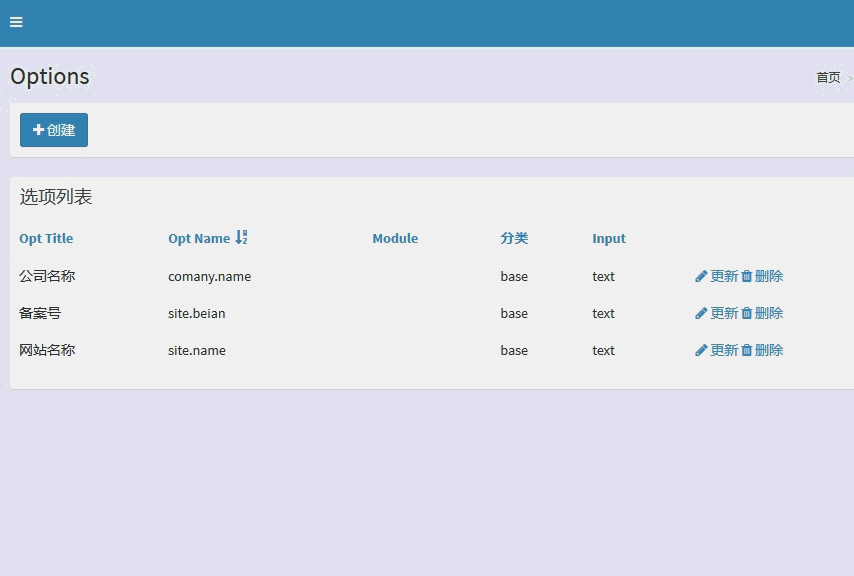

# mjax

Bootstrap Modal for Yii2 By Ajax.解决在当前页面弹出编辑页面或者展示信息，不用跳转到其他页面。



## 安装

```
composer require dungang/mjax
```

## 使用

> 标记要绑定模态框的锚点

锚点标签添加 class `mjax`

```
<?= Html::a('<i class="fa fa-plus"></i> '.Yii::t('app', 'Create'), ['create'],
            ['class' => 'btn btn-primary mjax']) ?>
```

> 注册模态框

```
\dungang\mjax\Modal::widget([
    'selector'=>'.mjax',  //注册对象，默认为`.mjax`
    'options'=>[
        'refresh'=>true //关闭模态框后是否刷新当前页面
    ]
])
```

> 注意事项

`ajax`返回的表当页面的`form`不用用`ActiveForm` 默认生成的`id`编号,请手动指定具体一读唯一的编号，比如：option-form

因为发起`ajax`请求的页面的`widget`可能也是自动生成的元素的`id`，则会跟表单页面的id重复就会被覆盖，导致js事件失效

```
$form = ActiveForm::begin([
        'id'=>'option-form'
    ]); 
```

## 协议

The MIT License (MIT)

Copyright (c) 2017 dungang

Permission is hereby granted, free of charge, to any person obtaining a copy of
this software and associated documentation files (the "Software"), to deal in
the Software without restriction, including without limitation the rights to
use, copy, modify, merge, publish, distribute, sublicense, and/or sell copies of
the Software, and to permit persons to whom the Software is furnished to do so,
subject to the following conditions:

The above copyright notice and this permission notice shall be included in all
copies or substantial portions of the Software.

THE SOFTWARE IS PROVIDED "AS IS", WITHOUT WARRANTY OF ANY KIND, EXPRESS OR
IMPLIED, INCLUDING BUT NOT LIMITED TO THE WARRANTIES OF MERCHANTABILITY, FITNESS
FOR A PARTICULAR PURPOSE AND NONINFRINGEMENT. IN NO EVENT SHALL THE AUTHORS OR
COPYRIGHT HOLDERS BE LIABLE FOR ANY CLAIM, DAMAGES OR OTHER LIABILITY, WHETHER
IN AN ACTION OF CONTRACT, TORT OR OTHERWISE, ARISING FROM, OUT OF OR IN
CONNECTION WITH THE SOFTWARE OR THE USE OR OTHER DEALINGS IN THE SOFTWARE.